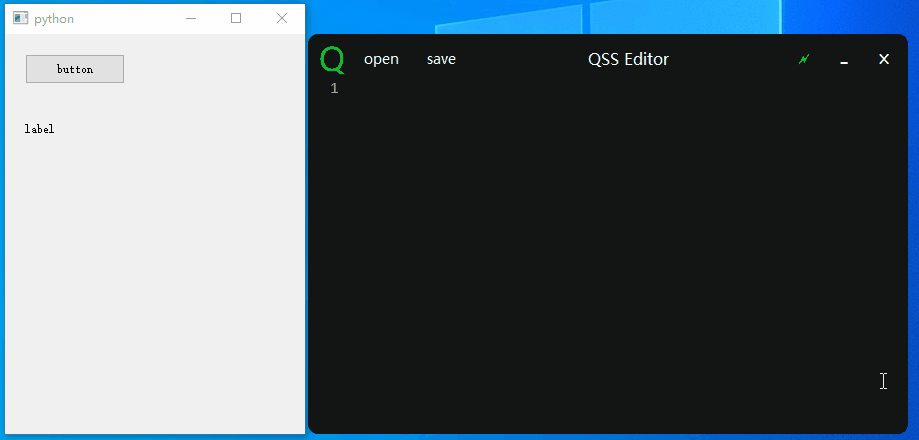
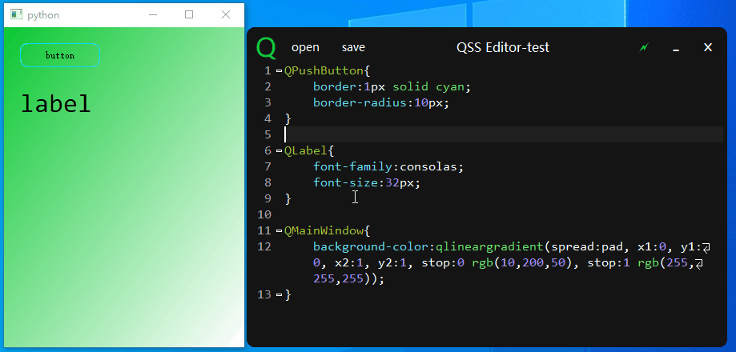

# pyqss

English | [简体中文](README.md)

A simple QSS editor

## Install

```shell
pip install pyqss
```

## Features

- [x] Live preview
- [x] Syntax highlighting
- [x] Auto-completion
- [x] i18n
- [x] Find and replace
- [x] File drag and drop
- [x] Auto-attach

## Usage

**shortcut keys**:

- `Ctrl+/`：comment
- `Ctrl+F`：find and replace

Import QSS from pyqss and register the MainWindow into QSS, and enjoy it：[example](./examples/test.py)

```python
if __name__ == '__main__':
    import sys
    from PyQt5.QtWidgets import QApplication, QMainWindow
    from pyqss import Qss

    app = QApplication(sys.argv)
    main_window = QMainWindow()
    main_window.show()
    # register  main_window
    qss = Qss(main_window)
    qss.show()

    app.exec_()
```

## Screenshot



