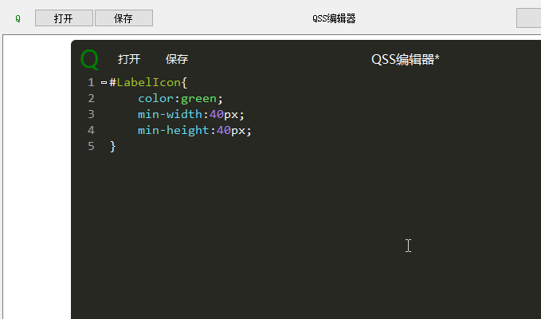

# pyqss

一个简约的QSS编辑器

## 安装

```shell
python setup.py install
```

## 使用方法

从pyqss中导入Qss，将主界面注册到Qss中，即可使用：

```python
if __name__ == '__main__':
    import sys
    from PyQt5.QtWidgets import QApplication
    from pyqss import Qss

    app = QApplication(sys.argv)
    test_window = TestWindow()
    test_window.show()
    # 将主窗口注册到Qss中
    qss = Qss(test_window)
    qss.show()

    app.exec_()
```
## 效果图
